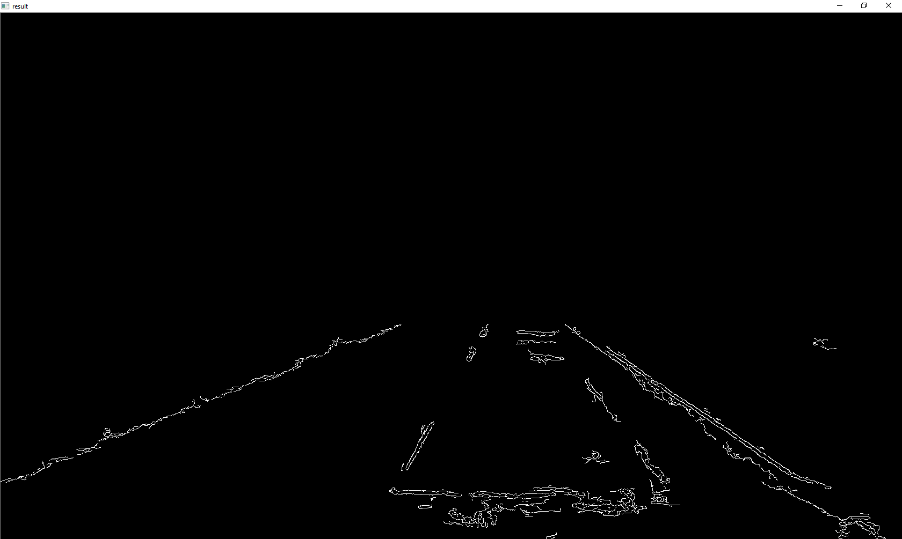
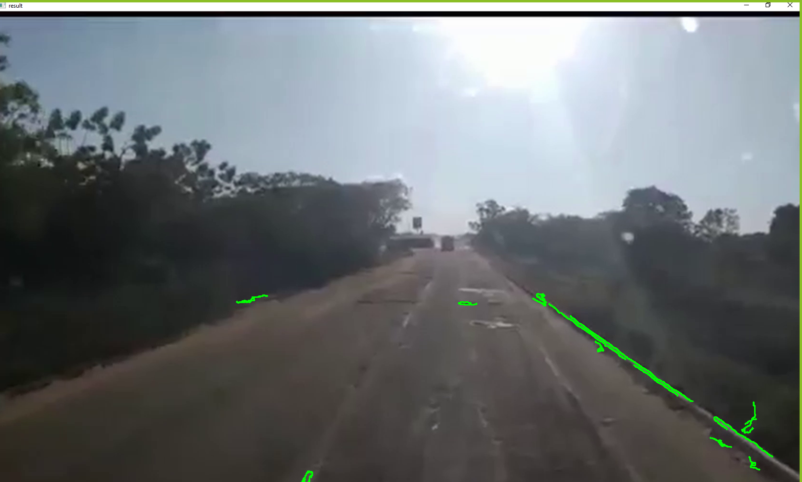
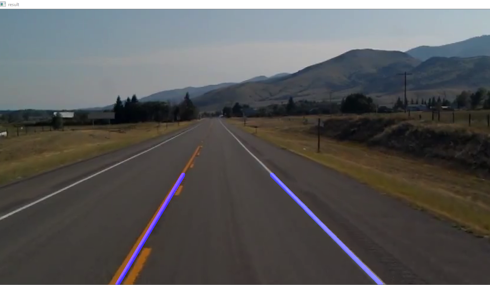
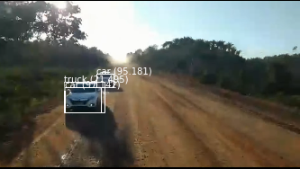
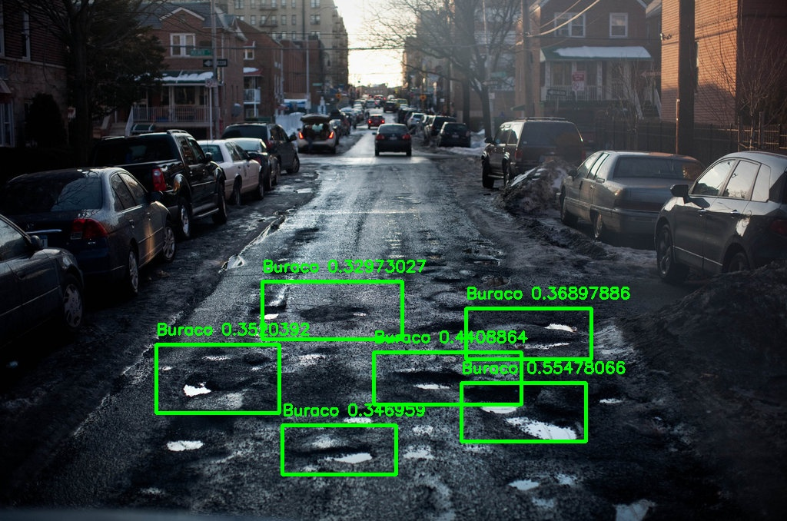
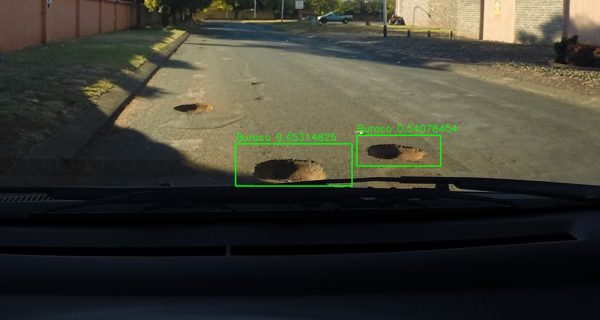
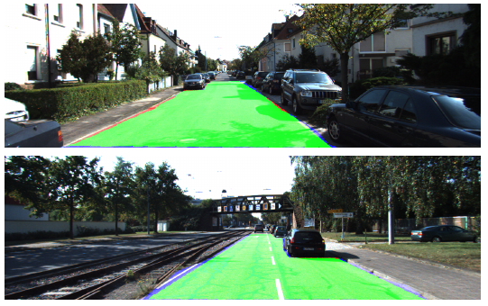
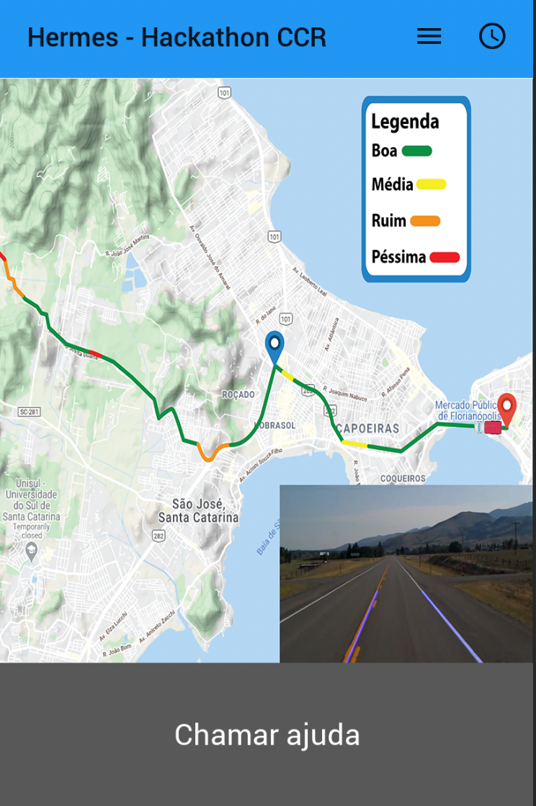
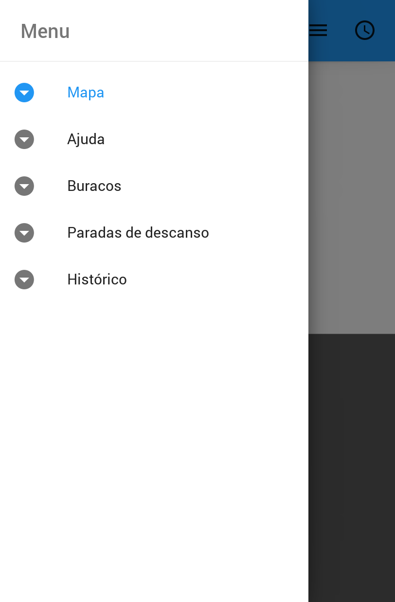
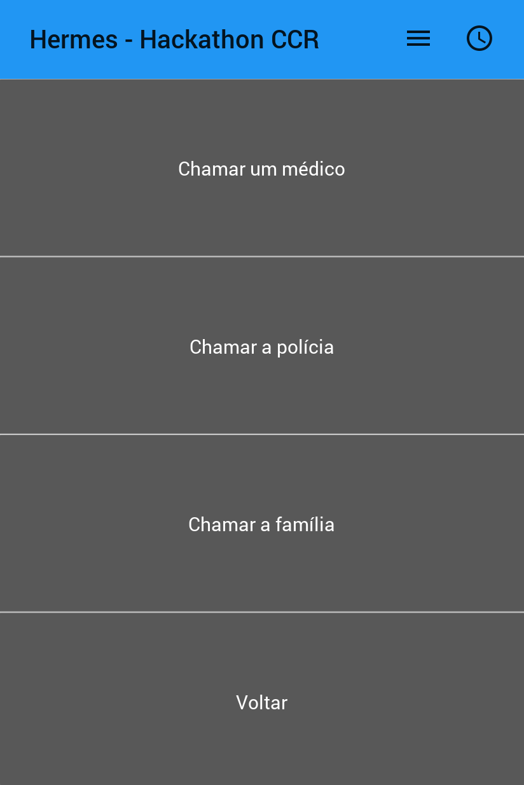

# Project-Hermes

This is the project from team 226 of the CCR Hackathon 2020, Brazil.

# Machine Learning

## Road Quality Measurement

Using the Canny edge detector we are able to quantify how irregular a road is and how many bumps/potholes/defects it has. The objective quantification of the road quality is done using the following Key Indicators:

1) Amount of edges detected, defining the indicator as:

$\frac{\sum_{i=0,j=0}^{width, height} edges(i,j)}{width*height}, \text{  where } width, height \in \R$

2) Number of detected contours (closed-form edges)
3) Size of detected contours

From these three indicators, the number of detected contours (2) shows a better correlation with the quality of the road as evaluated by a human. For roads in a bad situation, average 400 contours are detected per frame, while for roads in a good condition, on average 200 contours are detected per frame.

## Road lanes identification
Using the Hough Transform we can detect the lane lines, allowing our system to detect whenever the driver sways off the road

## Cars and people detection

Using YoloV3 Convolutional Neural Network architecture we can identify *where* objects of interest are, like cars or persons. This Neural Network was trained on MSCOCO dataset and is able to identify 80 different types of objects, including: person, bicycle, car, truck, traffic light, stop sign, cow, horse, etc.

Prediction sample:

## Pothole detection

Using a neural network similar to the one used for cars and people detection but trained specifically to identify potholes (buracos in Portuguese,) we are able to accurately find and label where potholes are in a video feed. 

The training was performed and made available by [Suman Kumar Jha](https://github.com/jhasuman/potholes-detection)

To perform a prediction, run: `python3 predict.py -c config.json -w models/full_yolo_backend.h5 -i ../models/img10.png` 

Predictions samples:

## Road segmentation

If we had more time, we would implement a Neural Network to road segmentation following the academic publication of [Yecheng Lyu et al](https://arxiv.org/abs/1808.04450).

The following image is a sample of **their paper** (not our result):

# Mobile

We are using the Framework Kivy (Python language) to develop a minimum viable app.

The visualization dashboard was developed using Infrogram platform.

Below is the home screen of the app that shows the driver’s route marked over by the algorithm. Each colour code represents the difficulty of driving in that area, starting from green to yellow, orange and red. Green means good, with little to no bumps, yellow means few bumps, orange means bumpy and red means extremely bumpy. 

On the bottom right of the screen there is a mini-video that shows the current movement of the car indicating if it is driving within the lanes. 

At the bottom of the screen there is an option to call for help.

This is the menu screen of the app with the following options: Map, Help, Potholes, Rest stops, History.

Another screen of the app with the following options of calling a doctor,a police officer or a family member. There is a button to return to the home screen.

The flashing screen that pops up when the driver loses focus and is no longer driving safely. The screen then says “Help is on the way”. 

